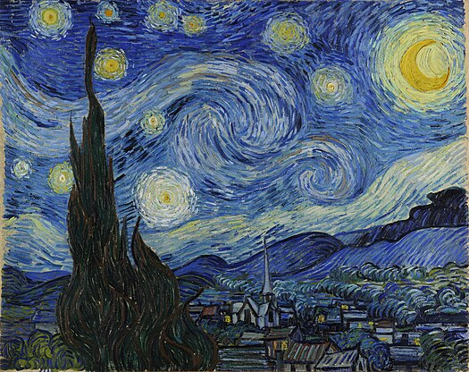

# pcai_0714_tut4_quiz8

## Part 1: Imaging Technique Inspiration

1. 



2. In Van Gogh's work Starry Sky, a large number of flowing lines are used to construct the entire picture, making the whole picture full of fluidity. Each line in the work converges with each other, yet is clear and independent. It will be a good artistic technique to reconstruct the artwork in the major project.


## Part 2: Imaging Technique Inspiration

1. 


2. In this code example, the author also uses the particle line expression technique to simulate some artworks by constantly controlling the expansion and contraction direction of the particles. This technique can be used to construct other artistic images.

3. 
[Inspiration Link] (https://openprocessing.org/sketch/1593476)

4. 
``` 
var particles;
var img = []
var n, s, maxR;
var indexImg = 0;

function setup() {
	createCanvas(windowWidth, windowHeight);
	background("#FFEDDA");
	smooth();
	
	n = 1000;
	s = 20;
	maxR = height/2 - height/10;
	
	particles = [];
	
	img.push(loadImage('Las amapolas - Claude Monet.png'));
	img.push(loadImage('Autorretrato - Vicent Van Gogh.png'));
	img.push(loadImage('La lechera de burdeos - Francisco de Goya.jpg'));
	img.push(loadImage('Muchacho mirando una aparicion - Francisco de Goya.png'));
}

function draw() {
	translate(width/2, height/2);
	noStroke();
	
	if(s > 1) {
		if(particles.length != 0) {
			for(let i = 0; i < particles.length; i++) {
				var p = particles[i];
				p.show();
				p.move();
				
				if(p.isDead()) particles.splice(i, 1);
			}
		} else {
			s -= 2;
			initParticles();
		}
	}
}

function initParticles() {	
	for(let i = 0; i < n; i++) {
		particles.push(new Particle(maxR, s));
		
		var p = particles[i];
		var x = int(map(p.pos.x, -maxR, maxR, 0, img[indexImg].width));
    var y = int(map(p.pos.y, -maxR, maxR, 0, img[indexImg].height));
		p.c = img[indexImg].get(x, y);
	}
}

function mousePressed() {
	indexImg = (indexImg + 1) % img.length;
	setup();
}

class Particle {
  
  constructor(maxR_, s_) {
    this.s = s_;
    this.c = "";
    this.maxR = maxR_;
    
    this.life = 100;
    
    this.init();
  }
  
  init() {
    this.pos = p5.Vector.random2D();
    this.pos.normalize();
    this.pos.mult(random(2, maxR));

    this.vel = createVector();
  }

  show() {
    fill(this.c);
    ellipse(this.pos.x, this.pos.y, this.s, this.s);
    this.life -= 1;
  }
  
  move() {
    var angle = noise(this.pos.x / 400, this.pos.y / 400) * TAU;
    
    this.vel.set(cos(angle), sin(angle));
    this.vel.mult(0.3);
    this.pos.add(this.vel);
  }
  

  isDead() {
    var d = dist(this.pos.x, this.pos.y, 0, 0);
 
    if(d > this.maxR || this.life < 1) return true;
    else return false;
  }
}
```